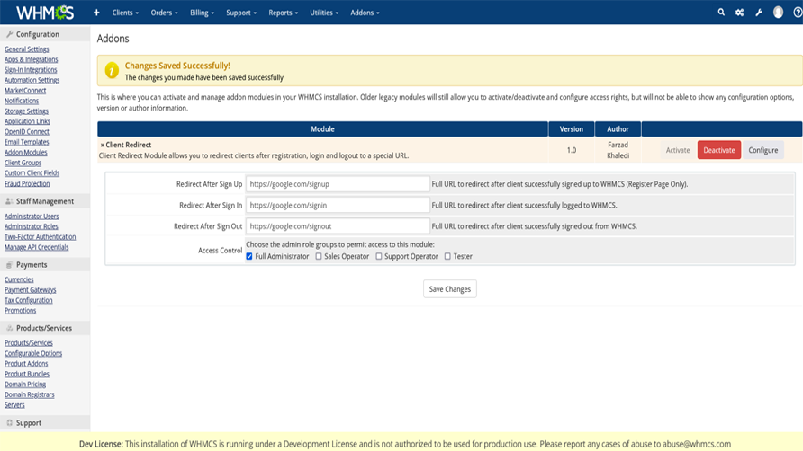

# Client Redirect WHMCS
**Client Redirect** Client Redirect Module allows you to redirect clients after registration, login and logout to a special URL.

**Features**

- Setup URL to redirect after signin
- Setup URL to redirect after signup
- Setup URL to redirect after signout
- Working with WHMCS 8.x
- Without any template changes
- Working with any WHMCS templates

## Install

Download addon latest version form [latest release](https://github.com/farzadkhaledi/clientredirect/releases/latest) and extract files, then upload **clientredirect** folder to YOUR_WHMCS_ROOT/modules/addons folder.

Then login to your WHMCS admin area and in System Settings -> Addons Modules active **Client Redirect** addon.

## Folders

<pre>
clientredirect/
├── clientredirect.php
├── hooks.php
├── index.php
├── whmcs.json
└── logo.png
</pre>

## License

All contents are licensed under the [MIT license].

[mit license]: LICENSE
